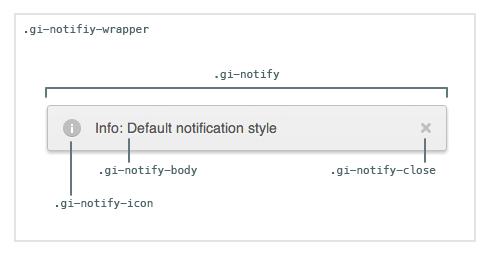

# Notifications

[Github Link](html/notifications_github.html "include")

The Notifications widget provides real-time growl-like messages inside your
application.  Easy to extend with custom notification types, namespaces,
foundational styles, and sane defaults.

[Notifications](html/notifications_demo_iframe.html "include")

## Table of Contents

1. [Code Example](#code-example)
1. [HTML](#html)
1. [CSS](#css)
1. [Constructor](#constructor)
1. [Notifications#subscribe](#notifications#subscribe)
1. [Notifications#unsubscribe](#notifications#unsubscribe)
1. [Notifications#publish](#notifications#publish)
1. [Notifications#destroy](#notifications#destroy)

## Code Example

### 1. Include our CDN assets:

#### Note on Versioning

Specific version of widgets can be found on our [CDN](https://cdn.goinstant.net/).

```html
<script type="text/javascript" src="https://cdn.goinstant.net/v1/platform.min.js"></script>
<script type="text/javascript" src="https://cdn.goinstant.net/widgets/notifications/latest/notifications.min.js"></script>
<!-- CSS is optional -->
<link rel="stylesheet" href="https://cdn.goinstant.net/widgets/notifications/latest/notifications.css" />
```

### 2. Create and initialize the widget:

```js
// Connect URL
var url = 'https://goinstant.net/YOURACCOUNT/YOURAPP';

// Connect to GoInstant
goinstant.connect(url, function(err, platformObj, roomObj) {
  if (err) {
    throw err;
  }

  // Create a new instance of the Notifications widget
  var notifications = new goinstant.widgets.Notifications();

  // Get all notifications
  notifications.subscribe(roomObj, function(err) {
    if (err) {
      throw err;
    }
    // We're now receiving notifications
  });

  // Set options for the notification we're about to publish
  var options = {
    room: roomObj,
    type: 'success',
    message: 'Success: Message delivered',
    displayToSelf: true
  };

  // Send a single notification
  notifications.publish(options, function(err) {
    if (err) {
      throw err;
    }
    // Notification has been sent
  });
});
```

## HTML

### Notification Container

The notifications are rendered to a `div` that is appended to page body once the first notification is received.

```html
<div class="gi-override">
  <!--  Your notifications go here -->
</div>
```

### Notification Element

Each notification is prepended to the notification container.  The notification `type` specified when you publish a notification is used in the image path and the type class `gi-notify-[YOURTYPE]`

```html
<div class="gi-notify gi-notify-[YOURTYPE]">
  <div class="gi-notify-icon">
    <span><!-- Image icon set via css --></span>
  </div>
  <span class="gi-notify-body"><!-- Your message here --></span>
  <a href="#" class="gi-notify-close">
    <span><!-- Close icon set via css --></span>
  </a>
</div>
```
## CSS

### Customizing the default CSS

Each class is prefixed with `gi` to avoid conflicts.  The top-level container
also has a `.gi-override` class. Our goal is to make each widget as easy as
possible to customize.

If you have not included our CSS file, you do not need to use the `gi-override`
class when styling the widget.



This stylesheet provides a good starting point for customizing the notification:

```css
.gi-notify-container.gi-override {
  /* Notification container position customizations */
}

.gi-override .gi-notify {
  /* Base notification style customizations */
}

.gi-override .gi-notify-YOURTYPE {
  /* Add custom type styles */
}

.gi-override .gi-notify-YOURTYPE .gi-notify-icon {
  /* Add an icon for your custom type */
}
```

## Constructor

Creates a new instance of the `Notifications` widget, this instance is primarily
used to publish, subscribe, and configure notifications.

### Methods

- ###### **new Notifications()**
- ###### **new Notifications(optionsObject)**

### Parameters
| optionsObject |
|:---|
| Type: [Object](https://developer.mozilla.org/en-US/docs/Web/JavaScript/Reference/Global_Objects/Object) |
| An object with the following options: |
| - `maxDisplayed` [**default: 3**] is an integer which dictates the maximum number of notifications that will be displayed at any one time. |
| - `displayTimer` [**default: 3000 (3 seconds)**] is an integer which dictates the duration a notification is displayed. The display timer will be suspended while a user hovers over a notification.
| - `container` [**default: element with class '.gi-notify-container'**] is the [element](https://developer.mozilla.org/en-US/docs/DOM/element) to which notifications will be prepended. |
| - `position` [**default: 'top'**] is a string, used to determine the position of the notifications container, must be one of the following: 'top-left', 'top, top-right', 'bottom-left', 'bottom', 'bottom-right' |

### Example

```js
var customContainer = document.querySelector('.gi-notify-container');

var notifications = new Notifications({
  maxDisplayed: 3,
  displayTimer: 3000,
  container: customContainer,
  position: 'top'
});
```

## Notifications#subscribe

Subscribe to notifications published to the specified Room.

### Methods

- ###### **notifications.subscribe(room, callback(errorObject))**

### Parameters

| room |
|:---|
| Type: [Object](https://developer.mozilla.org/en-US/docs/Web/JavaScript/Reference/Global_Objects/Object) |
| `room` is a [GoInstant Room](https://developers.goinstant.net/v1/rooms/index.html), or an array of rooms that you have previously joined. |

| callback(errorObject) |
|:---|
| Type: [Function](https://developer.mozilla.org/en-US/docs/Web/JavaScript/Reference/Global_Objects/Function) |
| Called if an issue was encountered attempting to subscribe to the room. |
| - `errorObject` will be `null` unless an error has occured. |

### Example

```js
var exampleRoom = platform.room('exampleRoom');

exampleRoom.join(function(err) {

  notifications.subscribe(exampleRoom, function(err) {
    // We're receiving notifications from exampleRoom!
  });

});
```

## Notifications#unsubscribe

Unsubscribe from all notifications associated with this instance.

### Methods

- ###### **notifications.unsubscribe(callback(errorObject))**

### Parameters

| callback(errorObject) |
|:---|
| Type: [Function](https://developer.mozilla.org/en-US/docs/Web/JavaScript/Reference/Global_Objects/Function) |
| Called if an issue was encountered attempting to unsubscribe from rooms associated with this instance. |
| - `errorObject` will be `null` unless an error has occured. |

### Example

```js
var exampleRoom = platform.room('exampleRoom');

exampleRoom.join(function(err) {

  notifications.subscribe(exampleRoom, function(err) {
    // We're receiving notifications from exampleRoom!
  });

  notifications.unsubscribe(exampleRoom, function(err) {
    // Not anymore!
  });

});
```

## Notifications#publish

Publish a new notification to the `room` or `rooms` specified with the given `message` and (optional) message `type`.  Users subscribed to this room will receive this notification.

### Methods

- ###### **notifications.publish(optionsObject)**
- ###### **notifications.publish(optionsObject, callback(errorObject))**

### Parameters

| optionsObject |
|:---|
| Type: [Object](https://developer.mozilla.org/en-US/docs/Web/JavaScript/Reference/Global_Objects/Object) |
| An object containing the `room`, `message` and message `type` |
| - `room` is a [GoInstant Room](https://developers.goinstant.net/v1/rooms/index.html) or an array of rooms that you have previously joined. |
| - `message` is the message that will be inserted into the body of the notification. |
| - `type` [**default: info**] is the type of message, which can be 'info', 'warning', 'error', or 'success'. |
| - `displayToSelf` [**default: false**] when true and the notification is published succesfully it will be displayed locally too. |

| callback(errorObject) |
|:---|
| Type: [Function](https://developer.mozilla.org/en-US/docs/Web/JavaScript/Reference/Global_Objects/Function) |
| Called once the notification has been sent or when an error has occured . |
| - `errorObject` will be `null` unless an error has occured. |

### Example

```js
notifications.publish({
  room: exampleRoom,
  type: 'success',
  message: 'Success: Message delivered!'
}, function(err) {
  if (err) {
    // Uh oh: the message wasn't delivered
    console.log(err);
  }
});
```

## Notifications#destroy

Stop listening to notifications & remove the notifications container from the DOM.

### Methods

- ###### **notifications.destroy()**
- ###### **notifications.destroy(callback(errorObject))**

### Parameters

| callback(errorObject) |
|:---|
| Type: [Function](https://developer.mozilla.org/en-US/docs/Web/JavaScript/Reference/Global_Objects/Function) |
| Called upon the completion of `Notifications.destroy`. |
| - `errorObject` will be `null` unless an error has occured. |

### Example

```js
notifications.destroy(function(errorObject) {
  // Your now unsubscribed & notification indicators have been removed
});
```
